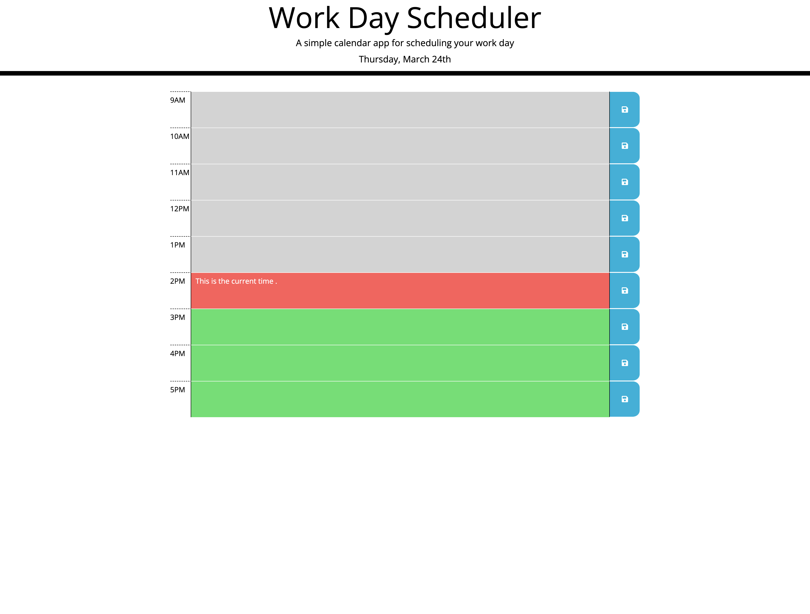

# Daily-Planner

This is a work day schedular application that enable the user to plan his/her time in a hourly calendar and assign colors to present, past and future hours. Stores and retrieve every data into and from the local storage.

# languages

- HTML
- CSS
- JQuery
- Javascript

# Links

- The link to deploy the application: https://bongomin256.github.io/Work-Day-Planner/

# Screenshot of the Application

